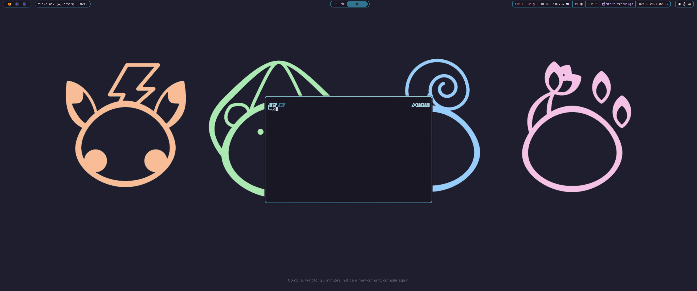
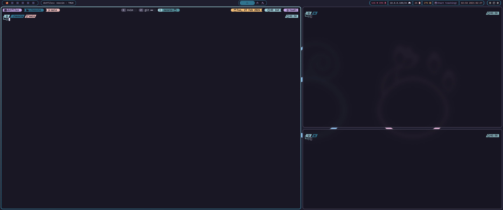
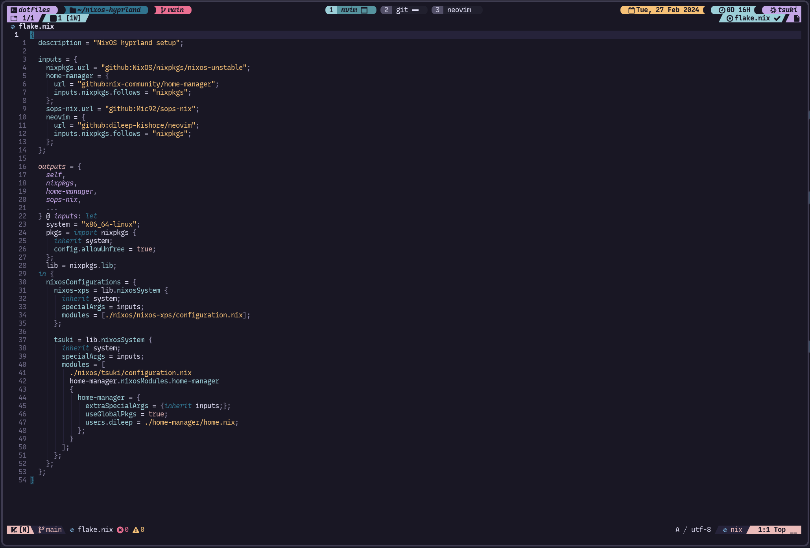
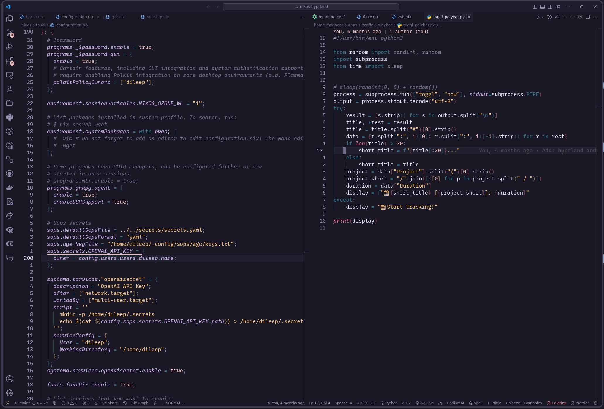
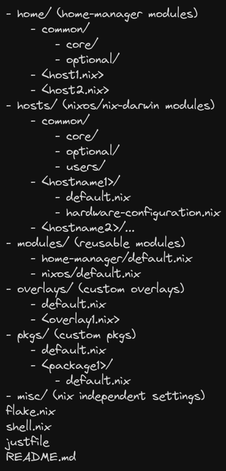

<!-- markdownlint-disable -->
<h1 align="center">
    <a name="top" title="nixos-config">
        nixos-config
    </a>
</h1>
<div align="center">
    <sup>
        <a href="https://nixos.org"></a>
    </sup>
        <br/>
        <sub>
            <a href="https://nixos.org/manual/nix/stable/language/index.html" target="_blank">
            
            </a>
            <a href="https://nixos.wiki/wiki/Flakes" target="_blank">
            
            </a>
            <a href="https://github.com/nix-community/home-manager" target="_blank">
            
            </a>
        </sub>
    </div>
</div>

<div align="center">
    Dotfiles for my personal <a href="https://hyprland.org">Hyprland</a> setup on <a href="https://nixos.org">NixOS</a>.
</div>
<!-- markdownlint-restore -->

## Setup

- OS: [NixOS](https://nixos.org)
- Window manager: [Hyprland](https://hyprland.org)
- Status bar: [Waybar](https://github.com/Alexays/Waybar)
- Terminal: [Kitty](https://github.com/kovidgoyal/kitty)
- Shell: `Zsh` with plugins managed through [antidote](https://github.com/mattmc3/antidote)
- Current theme: [Rosé Pine](https://rosepinetheme.com)
- Font: [Recursive](https://www.recursive.design)
- Editor: [Neovim](https://neovim.io) with NvChad. Configuration can be found [here](https://github.com/sonroyaalmerol/nvchad-personal-config)

## Gallery

|             Desktop              |
| :------------------------------: |
|  |

|           Terminal + Tmux            |
| :----------------------------------: |
|  |

|             Neovim             |
| :----------------------------: |
|  |

|             VSCode             |
| :----------------------------: |
|  |

## Organization of the modules



## Installation

### Requirements

- NixOS 23.11 or Home-manager
- Patience
- Knowledge
- Disk space

### NixOS installation

Use `sudo just bs` or:

```sh
sudo nixos-rebuild switch --flake '.#<host>'
```

### Home-manager installation

Use `just hs` or:

```sh
home-manager switch --flake '.#<user>@<host>'
```
